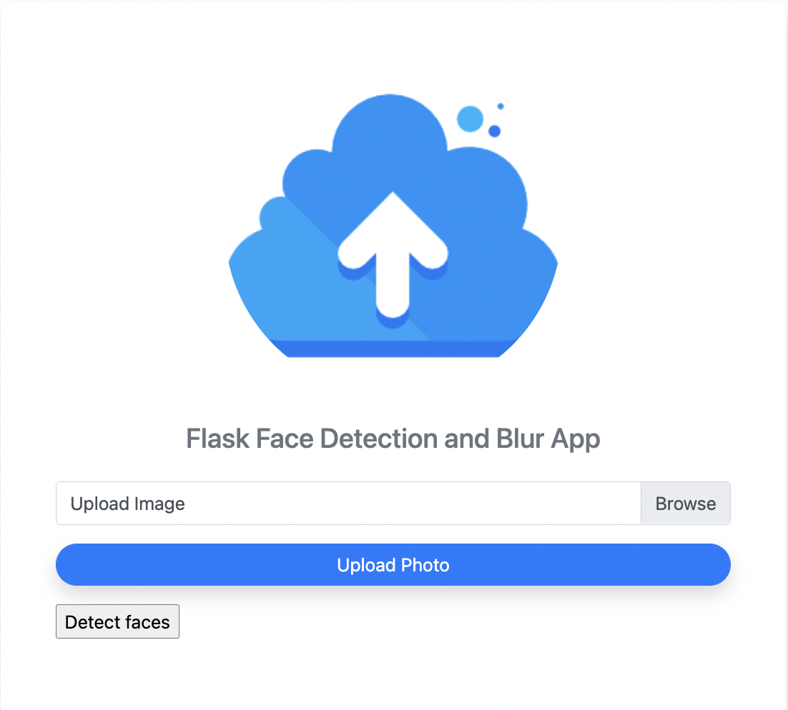
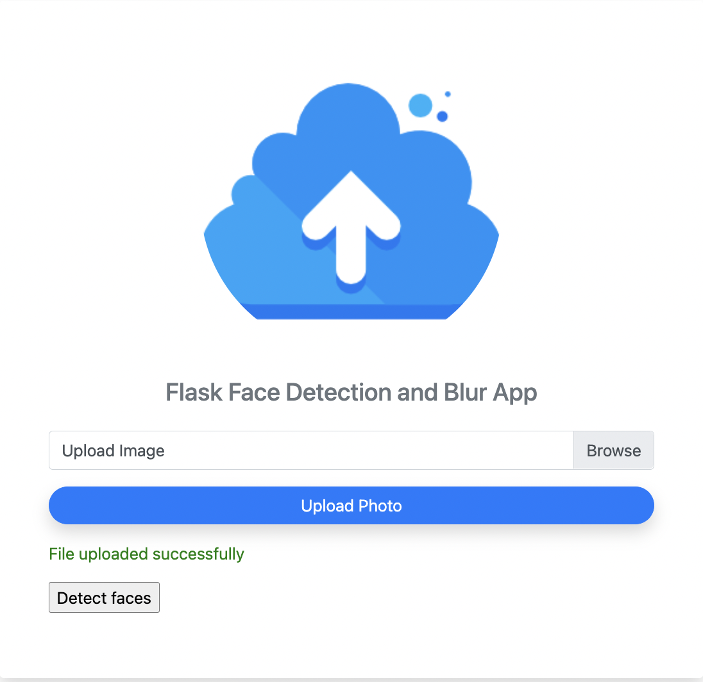
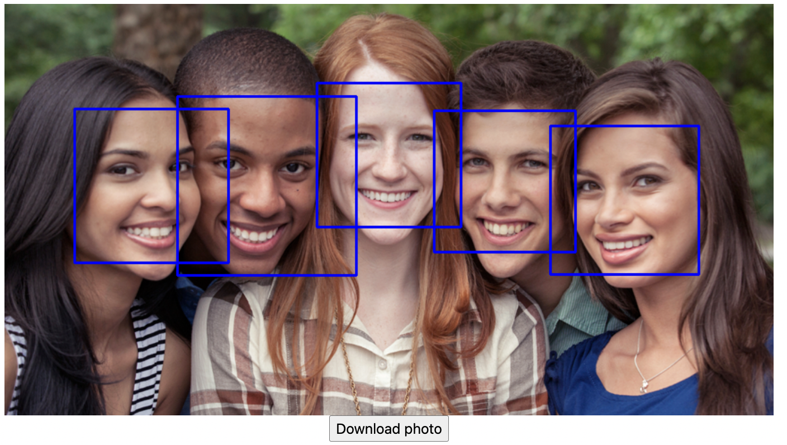
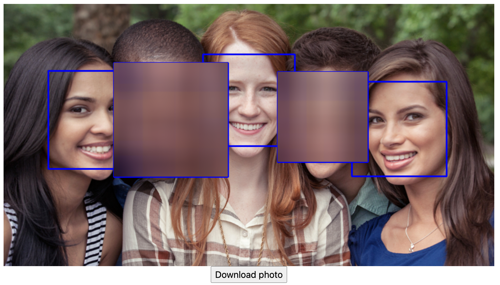
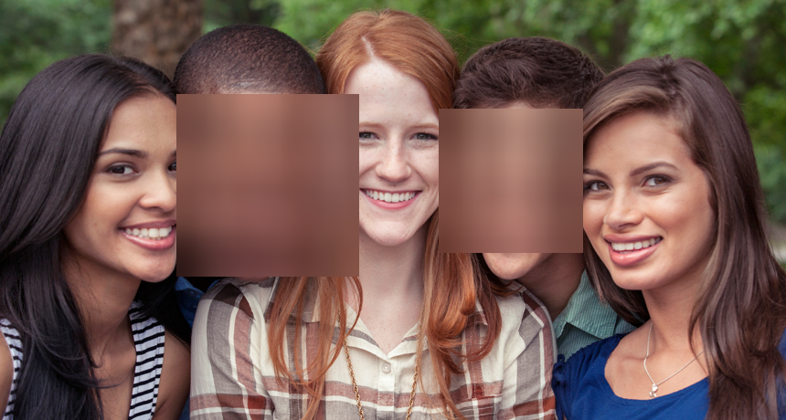

# Курсовая работа по предмету "Методы и средства обработки изображений"
Выполнила: Колесникова Анна, БПМ-20-1

## Описание
Приложение принимает файл с изображением (разрешения .jpg, .jpeg, .png) от пользователя, 
находит на нем лица и обводит их прямоугольниками. После этого по клику на лицо оно размывается,
чтобы было невозможно идентифицировать человека. При повторном клике размытие удаляется. 
Также есть возможность скачать файл после обработки.

## Технологии
Для детектирования лиц использовался CascadeClassifier из библиотеки opencv.
Была выбрана уже обученная модель, предоставляемая создателями opencv: 
https://github.com/opencv/opencv/blob/3.4/data/haarcascades/haarcascade_frontalface_default.xml
Перед поиском лиц, изображение приводится к черно-белому с помощью функции cvtColor(img, cv2.COLOR_BGR2GRAY).

Для размытия лиц использовалась функция blur из библиотеки opencv.

Веб-приложение создано с помощью фреймворка Flask. Было реализовано несколько эндпойнтов 
для загрузки и скачивания файлов, а также для их демонстрации и обработки кликов.
HTML и CSS код страниц был взят из открытых источников и отредактирован для данного проекта.

## Деплой
Ссылка: http://introvertess.pythonanywhere.com/
Приложение задеплоено через www.pythonanywhere.com. В связи с невозможностью настройки автоматического деплоя через CI/CD
в бесплатной версии, обновление приложения происходит вручную: в консоли сервера выполняется команда git pull 
и после этого перезапускается сборка и деплой приложения.

## Локальный запуск
1. Установить зависимости: pip install -r requirements.txt
2. Запустить приложение: flask --app app run

## Демо
1. Начальная страница

    
2. Успешная загрузка файла 

    

3. Найденные лица

   

4. Размытие некоторых лиц по клику

   

5. Скачанный файл

   
